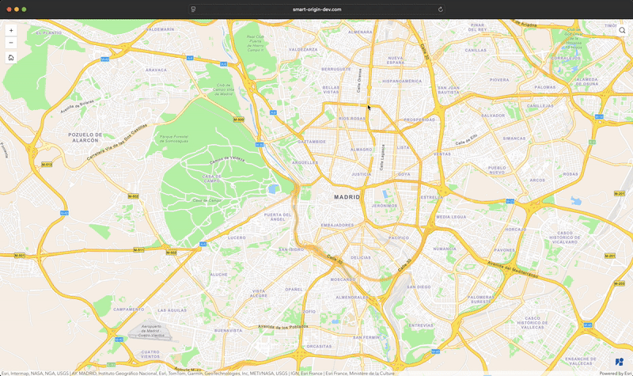

<div align="center">
  
  <h1>Google Street View Widget</h1>
  
  <p>
    Built for ArcGIS Experience Builder  —  Made with ❤️ by <a href="https://smart/origin.com">Smart/Origin</a>
  </p>
  <p>
    <a href="">
      
    </a>
    <a href="">
      
    </a>
  </p>
</div>

<br>

## About



This widget brings Google Street View into your ArcGIS Experience Builder applications. Click anywhere on the map to see street-level imagery, or open Street View directly from feature actions in popup.

## Features

- **📍 Map Integration**: Click anywhere on the map to instantly open Google Street View at that location.
- **🖱️ Popup Actions**: Integrates with ArcGIS popups, adding an "Open in Street View" action to your features.
- **📱 Responsive Design**: Offers two viewing modes:
  - **Reduced**: A non-intrusive floating panel, perfect for desktop use.
  - **Expanded**: A full-height side panel, optimized for mobile devices.
- **⚙️ Configuration**: Includes "Click-to-view" and "Popup-action" presets to quickly set up the widget for your specific use case.
- **🔗 External Links**: Option to open the current view directly in Google Maps for further exploration.
- **🌍 Internationalization**: Fully translated into French (`fr`) and English (`en`).
- **🎛️ Floating Control Panel**: An optional toggle button to enable/disable the widget on the fly, keeping the UI clean when not in use.

## Prerequisites

What you will need to use this widget:

**A Google API Key**

The widget uses Google's [Maps Embed API](https://developers.google.com/maps/documentation/embed/get-started) to display Street View imagery.

1. Head to the [Google Cloud Console](https://console.cloud.google.com/)
2. Create a project (or use an existing one)
3. Go to **APIs & Services** > **Library** and enable **Maps Embed API**
4. Go to **APIs & Services** > **Credentials** and create an API key

> [!NOTE]
> You'll need billing enabled on your Google Cloud account.

## Usage

The widget can be used in two main different ways, choose preset your prefer through the widget's settings tab in experience builder.

### 👆 Click-to-view (default)

Any click on the map opens Street View at that location in a floating panel, this is the default preset.

> [!NOTE]
> You can toggle the widget on and off through a floating control panel at the bottom right of the screen
>
> 

### ▶️ Popup action

Street View opens only when you click the "Open in Street View" button inside a feature popup. Map clicks work normally without triggering Street View (you can still enable it through settings).

> [!NOTE]
>
> 

> [!TIP]
> The "Open In Street View" action will still be present in the default "Click-to-view" mode, this mode exists specifically for users who do not wish to use the map click feature or see a permanent control panel

## Installation

### In ArcGIS Experience Builder Developer Edition

This widget is compatible with Experience Builder v1.16+. Grab it from the [downloads page](https://developers.arcgis.com/experience-builder/guide/downloads/) and follow the [setup guide](https://developers.arcgis.com/experience-builder/guide/install-guide/).

> [!NOTE]
> You'll need Node.js >=22 and npm to install experience builder

#### Dist Method

Best for quick use without code modifications.

1. Download latest [release](https://github.com/smartorigin/streetview-exb-widget/releases)
2. Extract the downloaded zip and copy the `street-view` folder into experience builder dist folder (`<your-exb>/client/dist/widgets`)
3. Add the json object found in `to-copy-in-widgets-info.json` into `<your-exb>/client/dist/widgets/widgets-info.json` (_only needed at first install_)

#### Your Extensions Method

Best for developers who want to modify the source code.

1. Clone the repo on your computer

```bash
git clone git@github.com:smartorigin/streetview-exb-widget.git
```

2. Copy the `street-view` folder into experience builder widgets folder (`client/your-extensions/widgets`)
3. Restart the Experience Builder client (via `npm start`)
4. The widget should appear in your widget panel after page reload

### In your own instance of portal for ArcGIS

Since ArcGIS Enterprise 11 you can reference your own ArcGIS Experience builder widgets in your portal for ArcGIS.

1. Download latest [release](https://github.com/smartorigin/streetview-exb-widget/releases)
2. Extract the downloaded zip and deploy the `street-view` folder to a webserver.
3. You should now have an url that points to the `manifest.json` file inside `street-view` folder.
4. Go to the `Contents` menu of your Portal for ArcGIS.
5. Click `add item`, the select the `add an Experience Builder Widget URL`.
6. Specify the url got at step 3.

## Configuration

### Prerequistes

Drag and drop the widget inside your app.

> [!TIP]
> To automatically bind the widget to your map, drag and drop it onto the map widget.

### Source options

| Setting            | Description                                                       |
| ------------------ | ----------------------------------------------------------------- |
| **Select a map**   | Choose the map widget to link with Street View.                   |
| **Google API key** | Enter your Google Maps API key (required for Street View embeds). |

### General Options

| Setting                           | Default         | Description                                                                                                                                                                |
| --------------------------------- | --------------- | -------------------------------------------------------------------------------------------------------------------------------------------------------------------------- |
| **Preset**                        | `Click To View` | Quickly choose between two main behaviors: <br>• **Click To View**: Opens Street View on any map click. <br>• **Popup Action**: Opens Street View only via a popup action. |
| **Enable popup action**           | `true`          | Adds an "Open In StreetView" action to feature popups.                                                                                                                     |
| **Enable map click**              | `true`          | Allows opening Street View by clicking anywhere on the map.                                                                                                                |
| **Enable position icon**          | `true`          | Shows a marker on the map indicating the current Street View location and heading.                                                                                         |
| **Enable floating control panel** | `true`          | Shows a floating button to toggle the widget on/off.                                                                                                                       |
| **Default control panel state**   | `off`           | Sets whether the widget starts active (`on`) or inactive (`off`).                                                                                                          |
| **Default view**                  | `Reduced`       | Choose the initial display mode: <br>• **Reduced**: Floating panel (best for desktop). <br>• **Expanded**: Full-height sliding panel (best for mobile).                    |

### StreetView API Options

> [!TIP]
> You can find more details on these parameters in the [documentation](https://developers.google.com/maps/documentation/streetview/request-streetview#optional-parameters) for the google's **Street View API**.

| Setting     | Default   | Description                                                                                                                                                                                                                                                 |
| ----------- | --------- | ----------------------------------------------------------------------------------------------------------------------------------------------------------------------------------------------------------------------------------------------------------- |
| **Heading** | `210°`    | Indicates the compass heading of the camera. Accepted values are from `0` to `360`. If you don't specify a heading, a value is calculated that directs the camera towards the specified location, from the point at which the closest photograph was taken. |
| **Pitch**   | `0°`      | Specifies the up or down angle of the camera relative to the Street View vehicle.                                                                                                                                                                           |
| **FOV**     | `90°`     | Determines the horizontal field of view of the image expressed in degrees, with a maximum allowed value of 120.                                                                                                                                             |
| **Radius**  | `50m`     | Sets a radius, specified in meters, in which to search for imagery, centered on the given latitude and longitude. Valid values are non-negative integers. (High radius causes the API to select static images over non-static images).                      |
| **Source**  | `Outdoor` | Limits Street View searches to selected sources. Valid values are: <br>• `All` uses the default sources for Street View, searches are not limited to specific sources. <br>• `Outdoor` limits searches to outdoor imagery.                                  |

## Roadmap

- [x] ~~French language support~~
- [x] Configurable API parameters

## Feature Requests

Have an idea for a new feature? Open an issue with the `feature request` label and describe what you'd like to see.

## Q&A

<details>
  <summary>What if I have two map widgets in my experience?</summary>
  Add this widget twice, one for each map.
</details>

## Project Structure

```
src/street-view/
├── icon.svg              # Widget icon for EXB menu
├── manifest.json         # Widget metadata
├── config.ts             # Configuration types
└── src/
    ├── setting/          # Settings panel UI
    └── runtime/
        ├── widget.tsx    # Main widget component
        ├── views/        # UI components
        ├── services/     # Map and Street View logic
        ├── hooks/        # React hooks
        ├── types/        # TypeScript types
        ├── translations/ # i18n strings
        ├── utils/        # Helper functions
        └── css/          # Styles
```

## License

[Apache-2.0 license](./LICENSE)
