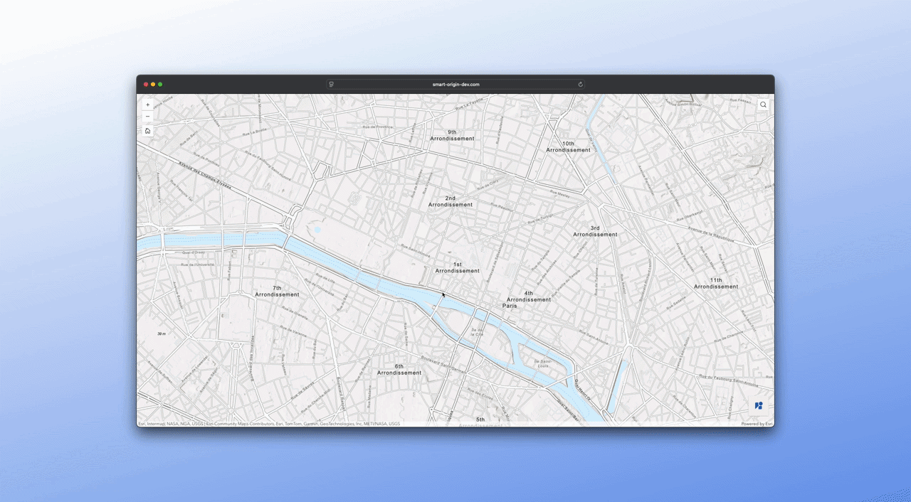
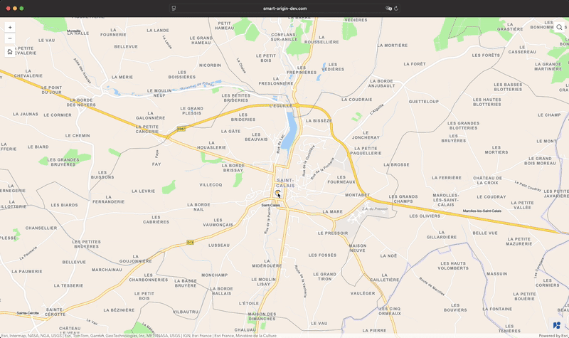

<div align="center">
  

# Widget Google Street View

Conçu pour ArcGIS Experience Builder — Développé avec ❤️ par [Smart/Origin](https://smart-origin.com/)


[English](/README.en.md) • Français

</div>

---



Ce widget intègre Google Street View dans vos applications ArcGIS Experience Builder. Cliquez sur la carte pour ouvrir Street View à cet emplacement, ou directement depuis l'action « Ouvrir dans Street View » d'une entité sélectionnée.

## Fonctionnalités

- **📍 Intégration carte** : Ouvre Street View à l'emplacement cliqué.
- **🖱️ Actions popup** : S'intègre aux popups ArcGIS, ajoutant une action « Ouvrir dans Street View » à vos entités.
- **📱 Design responsive** : Propose deux modes d'affichage :
  - **Réduit** : Un panneau flottant, pour une utilisation sur ordinateur.
  - **Étendu** : Un panneau latéral pleine hauteur, optimisé pour les appareils mobiles.
- **⚙️ Configuration** : Propose deux préréglages « Click to View » et « Popup Action » pour configurer rapidement le widget selon votre cas d'utilisation.
- **🔗 Liens externes** : Permet d'ouvrir la vue actuelle directement dans Google Maps.
- **🌍 Internationalisation** : Le widget est traduit en anglais et en français.
- **🎛️ Panneau de contrôle flottant** : Panneau de contrôle pour activer/désactiver le widget depuis l'application.

## Prérequis

Les prérequis à l'utilisation de ce widget :

**ArcGIS Experience Builder**

Ce widget est conçu pour ArcGIS Experience Builder v1.16+. Vous pouvez le télécharger depuis la [page de téléchargements](https://developers.arcgis.com/experience-builder/guide/downloads/) et suivre le [guide d'installation](https://developers.arcgis.com/experience-builder/guide/install-guide/).

> [!NOTE]
> Vous aurez besoin de Node.js >=22 et npm pour installer Experience Builder

**Clé API Google**

Le widget utilise l'[API Maps Embed](https://developers.google.com/maps/documentation/embed/get-started) de Google pour afficher l'imagerie Street View.

1. Rendez-vous sur la [Console Google Cloud](https://console.cloud.google.com/)
2. Créez un projet (ou utilisez un projet existant)
3. Allez dans **APIs & Services** > **Bibliothèque** et activez **Maps Embed API**
4. Allez dans **APIs & Services** > **Identifiants** et créez une clé API

> [!NOTE]
> La facturation sur votre compte Google Cloud doit être activée pour générer une clé.

## Utilisation

Le widget propose deux préréglages correspondant à deux modes d'utilisation, mais il est possible de configurer le widget différemment via l'onglet des paramètres du widget dans Experience Builder.

### 👆 Click to View (par défaut)

Lorsque la carte est cliquée, affiche l'imagerie Street View à cet emplacement. C'est le préréglage par défaut.

> [!NOTE]
> Vous pouvez désactiver l'ouverture de Street View sur clic via le panneau de contrôle flottant en bas à droite de l'écran.
>
> 

### ▶️ Popup Action

Street View s'ouvre uniquement via l'action « Ouvrir dans Street View » dans une popup d'entité. Permet d'accéder facilement à l'imagerie Street View d'une entité.

> [!NOTE]
>
> 

> [!TIP]
> L'action « Ouvrir dans Street View » sera aussi présente dans le mode « Click to View », ce mode existe spécifiquement pour les utilisateurs qui ne souhaitent pas utiliser la fonctionnalité Click to View.

## Installation

### Dans ArcGIS Experience Builder Developer Edition

Ce widget est compatible avec Experience Builder v1.16+. Suivez le [guide d'installation](https://developers.arcgis.com/experience-builder/guide/install-guide/) pour installer Experience Builder.

> [!NOTE]
> Vous aurez besoin de Node.js >=22 et npm pour installer Experience Builder

#### Méthode Dist

Idéale pour une utilisation rapide sans modification du code source.

1. Téléchargez la dernière [version](https://github.com/smartorigin/streetview-exb-widget/releases)
2. Extrayez le zip téléchargé puis copiez le dossier `street-view` dans le dossier dist d'Experience Builder (`<votre-exb>/client/dist/widgets`)
3. Ajoutez l'objet JSON trouvé dans `to-copy-in-widgets-info.json` dans `<votre-exb>/client/dist/widgets/widgets-info.json` (nécessaire uniquement lors de la première installation)

#### Méthode Your Extensions

Idéale pour les développeurs qui souhaitent modifier le code source.

1. Clonez le dépôt sur votre ordinateur

```bash
git clone git@github.com:smartorigin/streetview-exb-widget.git
```

1. Copiez le dossier `src/street-view` dans le dossier widgets d'Experience Builder (`<votre-exb>/client/your-extensions/widgets`)
2. Redémarrez le client Experience Builder (via `npm start`)
3. Le widget devrait apparaître dans votre panneau de widgets après rechargement de la page

### Dans votre propre instance de Portal for ArcGIS

Depuis ArcGIS Enterprise 11, vous pouvez référencer vos propres widgets ArcGIS Experience Builder dans votre Portal for ArcGIS.

1. Téléchargez la dernière [version](https://github.com/smartorigin/streetview-exb-widget/releases)
2. Extrayez le zip téléchargé et déployez le dossier `street-view` sur un serveur web
3. Vous devriez maintenant avoir une URL qui pointe vers le fichier `manifest.json` dans le dossier `street-view`
4. Allez dans le menu `Contenu` de votre Portal for ArcGIS
5. Cliquez sur `Ajouter un élément`, puis sélectionnez `Ajouter une URL de widget Experience Builder`
6. Spécifiez l'URL obtenue à l'étape 3

## Configuration

### Prérequis

Glissez-déposez le widget dans votre application.

> [!TIP]
> Pour lier automatiquement le widget à votre carte, glissez-déposez-le sur le widget carte.

### Options de source

| Paramètre                  | Description                                                                                            |
| -------------------------- | ------------------------------------------------------------------------------------------------------ |
| **Sélectionner une carte** | Choisissez le widget carte à lier avec Street View. Se fait automatiquement si une carte est présente. |
| **Clé API Google**         | Entrez votre clé API Google Maps (requise).                                                            |

### Options générales

| Paramètre                                   | Défaut          | Description                                                                                                                                                                                                     |
| ------------------------------------------- | --------------- | --------------------------------------------------------------------------------------------------------------------------------------------------------------------------------------------------------------- |
| **Préréglage**                              | `Click To View` | Choisissez rapidement entre deux comportements principaux : <br>• **Click To View** : Ouvre Street View sur tout clic sur la carte. <br>• **Popup Action** : Ouvre Street View uniquement via une action popup. |
| **Activer l'action popup**                  | `true`          | Active l'ajout d'une action « Ouvrir dans Street View » aux popups d'entités.                                                                                                                                   |
| **Activer le clic sur la carte**            | `true`          | Active l'ouverture de Street View par un clic sur la carte.                                                                                                                                                     |
| **Activer l'icône de position**             | `true`          | Affiche un marqueur sur la carte indiquant l'emplacement initial de Street View.                                                                                                                                |
| **Activer le panneau de contrôle flottant** | `true`          | Affiche un panneau de contrôle flottant pour activer/désactiver le widget.                                                                                                                                      |
| **État par défaut du panneau de contrôle**  | `off`           | Définit si le panneau de contrôle démarre actif (`on`) ou inactif (`off`).                                                                                                                                      |
| **Vue par défaut**                          | `Réduit`        | Choisissez le mode d'affichage initial : <br>• **Réduit** : Panneau flottant (idéal pour desktop). <br>• **Étendu** : Panneau coulissant pleine hauteur (idéal pour mobile).                                    |

### Options de l'API Street View

| Paramètre   | Défaut    | Description                                                                                                                                                                                                                                                                                                 |
| ----------- | --------- | ----------------------------------------------------------------------------------------------------------------------------------------------------------------------------------------------------------------------------------------------------------------------------------------------------------- |
| **Heading** | `210°`    | Indique la direction prise par la boussole dans la vue de l'appareil photo. Les valeurs peuvent varier de `0` à `360`. Si vous ne spécifiez pas de direction, une valeur est calculée de façon à diriger l'appareil photo vers l'emplacement spécifié, selon l'angle de vue de la photo prise au plus près. |
| **Pitch**   | `0°`      | Spécifie l'angle vers le haut ou le bas de la caméra par rapport au véhicule Street View.                                                                                                                                                                                                                   |
| **FOV**     | `90°`     | Détermine le champ de vision horizontal de l'image exprimé en degrés, avec une valeur maximale autorisée de `120`.                                                                                                                                                                                          |
| **Radius**  | `50m`     | Définit un rayon, spécifié en mètres, dans lequel rechercher de l'imagerie, centré sur la latitude et la longitude données. Les valeurs valides sont des entiers non négatifs. (Un grand rayon pousse l'API à sélectionner des images statiques plutôt que non statiques).                                  |
| **Source**  | `Outdoor` | `All` utilise les sources par défaut pour Street View ; les recherches ne sont pas limitées à des sources spécifiques. `Outdoor` limite les recherches aux collections extérieures. Les collections d'intérieur ne sont pas incluses dans les résultats de recherche.                                       |

## Feuille de route

- [x] ~~Version française~~

## Demandes de fonctionnalités

Une idée ou suggestion ? Ouvrez une issue avec le label `feature request`.

## FAQ

<details>
  <summary>Que faire si j'ai deux widgets carte dans mon expérience ?</summary>
  Ajoutez ce widget deux fois, un pour chaque carte.
</details>

## Structure du projet

```
src/street-view/
├── icon.svg              # Icône du widget pour le menu EXB
├── manifest.json         # Métadonnées du widget
├── config.ts             # Types de configuration
└── src/
    ├── setting/          # Interface du panneau de paramètres
    └── runtime/
        ├── widget.tsx    # Composant principal du widget
        ├── views/        # Composants UI
        ├── services/     # Logique carte et Street View
        ├── hooks/        # Hooks React
        ├── types/        # Types TypeScript
        ├── translations/ # Chaînes i18n
        ├── utils/        # Fonctions utilitaires
        └── css/          # Styles
```

## Licence

[Licence Apache-2.0](./LICENSE)
